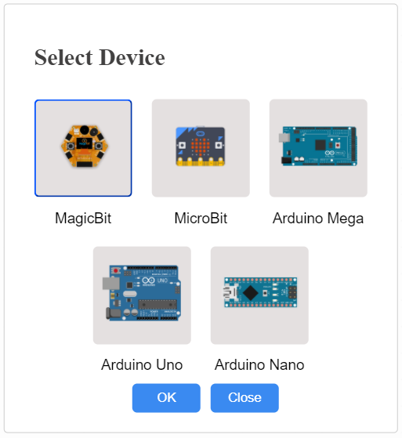
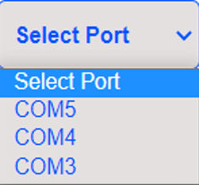
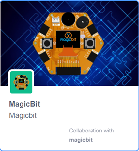
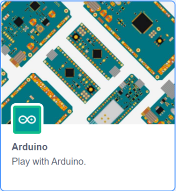
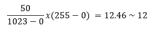

******************
What is MagicCode?
******************

**MagicCode** is a Scratch 3.0 based graphical programming software that makes you learn to code super-fast. If you are new to the world of programming, MagicCode is one of the best companions that makes coding fun and easy. The user-friendly interface and drag and drop functionality makes coding more interesting because of no need to worry about traditional programming rules. You can create your interactive games, animations, or program robots and projects with MagicCode. You can directly connect your Magicbit, Arduino, or Microbit boards with MagicCode and control generic sensors and actuators or It also has an upload mode where you can upload your code inside boards.

***************
Getting Started
***************

MagicCode interface and tools
=============================

.. image:: images/interface.png

- **Blocks**

A **block** is like a jigsaw puzzle piece that is used to write programs by simply dragging and dropping them below one another in the scripting area. Blocks are often easier to work with than text-based programming, as one has to memorize the commands typed and syntax errors may occur.There are ten categories of blocks: Motion, Looks, Sound, Event, Control, Sensing, Operators, Variables, List, and My Blocks. The list blocks are shown under the Variables Blocks.

- **Block palette**

The **block palette** is under the Code tab. It consists of different palettes such as Motion, Sound, and Control. Each palette has different blocks that perform functions specified by the palette name.There are other varieties of block palettes that can be loaded from the Add Extension button located at the left bottom.

- **Script**

A **script** is a program or code in MagicCode which is a collection or stack of blocks that all interlock with one another. The blocks and their order are very important, as they determine how sprites interact with each other and the backdrop. Sometimes, comments are attached to scripts to explain what certain blocks do and what the script's purpose is. You can write multiple scripts all of which can then run simultaneously

- **Connect Devices**

Connect Devices is used to connect devices (Magicbit, Arduino, or Microbit) with MagicCode.

- **Add Extensions**

Add Extensions is used to add new palettes to the block palette.

- **Sprite**

Sprites, either user-created, uploaded, or found in the MagicCode Sprites library, are the objects that perform actions in a project. Most projects have at least one sprite as well because only sprites can move.

.. figure:: images/sprite.png
   
   Sprite list 

Users can **give instructions** to a sprite (such as telling the sprite to move) by snapping blocks together in the script area. Clicking on the block(s) in the script area will cause the sprite to react based on the function of the block(s) clicked. Clicking on a sprite's thumbnail in the sprite pane will bring up the script area of that sprite.

The **look of a sprite can also be changed by using costumes**. The current costume of a sprite can be changed by clicking on the "costumes" tab and clicking on the desired costume of choice, or by using Looks blocks to select the sprite's costume. New costumes for the sprite can be imported, created, and edited in the MagicCode Paint Editor.

Some sprites additionally have at least one sound. Unlike costumes, sounds are an optional field, so you can have a sprite with no sounds. **The sounds tab** allows you to add, delete, and edit sounds. Sounds can be played in the sound editor or with blocks that play a specific sound.
Sprites (with all of their scripts, costumes, and sounds) can be exported, and then imported into another project if desired. This is achieved by right-clicking on a sprite's thumbnail in the sprite pane and then selecting "save to local file" in the pop-up menu. A sprite can also be dragged into the backpack and dragged out into another project for transporting. However, this will not save the sprite to one's computer.

- **Stage**

The **stage** is the background of the project where your sprites perform their actions,but it can have scripts, backdrops (costumes), and sounds, similar to a sprite and it has its own scripts and sounds.But the stage has some restrictions on sprite functions such as motion and size blocks.
 
The stage is 480 pixels wide and 360 pixels tall.All sprites have a particular position on the stage. However, no sprites can move behind the stage and it is always at the back layer.

.. figure:: images/stage.png
   
   The Stage list and the Stage with sprite on it

Devices
=======

The **Device** tab is the place where you can connect your boards with MagicCode. MagicCode provides facilities to connect five boards. You can connect your Magicbit, Arduino Uno, Arduino Mega, Arduino Nano, or Microbit Boards with MagicCode. You can program your board either in live mode or Upload mode.

.. figure:: images/device.png
   
   Device tab

**Live mode**

In the **Live** mode, you can view the program execution effect in real-time, which facilitates the commissioning of the program.

.. admonition:: Note
  
  In this mode, you must keep the board connected to MagicCode. If it is disconnected, then the program cannot be executed.

**Upload mode**

In the **Upload** mode, you need to upload the compiled program to the device. After being successfully uploaded, the program can still run properly on the device when the device is disconnected from MagicCode.

.. _connect:

Connecting devices  with USB connector
--------------------------------------

**1.	Connect your device to the pc with USB Connector**

**2.	Go to  the Device tab at the down right corner of MagicCode interface**

**3.	Select Live Mode or Upload Mode**

**4.	Select your Device by clicking the Select button.**

   Devices Library

The above Devices library is displayed after clicking the select button and select your devices from the library.

**5.	Select the Serial port where the device is connected.**

If you don’t see any port in the select port menu, then click the refresh button. Following figure dispays the select port menu.

   
   Select port menu

**6.	Click the connect button and connect your device to MagicCode**

After the device has connected, "Connect" button changes to “Disconnect” button and |newbutton1| is turned into |newbutton2|.

.. |newbutton1| image:: images/dconnect.png
                :scale: 60%

.. |newbutton2| image:: images/connect.png
                :scale: 60% 

.. figure:: images/d1.png
   :scale: 60%

   Device tab, before connecting to the device 
   
.. figure:: images/afterconnect.png
   :scale: 60%

   Device tab, after connecting to the device  

Now you can create and execute your program with your board.

MagicCode Extensions
====================

Magicbit extension
------------------

Magicbit Blocks
~~~~~~~~~~~~~~~

The block sets the digital state of the specified digital pin to either “High” or “Low”. If the output is High, the pin will be at 3.3V and if the output is Low the pin will be at 0V.

The block sets PWM output on Magicbit PWM pins. The user can select the output from a range of 0 to 100.  If the PWM output is 50, then half the time output will be high and for the rest, the output will be Low.

The block rotates the servo connected to the selected PWM pin on Magicbit with the selected angle(0,45,90,135,180) in degrees.

The block reads the state of the digital pin on Magicbit(“High” or “Low”). If the state of the pin is “High”, it returns True, else False.

The blocks output the status(“HIGH “or “LOW”) of the selected button(“left” or “right”).

Left button – Connected to D35 pin of Magicbit

Right button – Connected to D34 pin of Magicbit

when the button has not been pressed the status of the button is 1(HIGH), & when the button has pressed the status of the button is 0(LOW). 

The block returns the value of analog pins available in the connected hardware between the value range 0 to 4096. This range is mapped to the voltage of the pin (normally 0 to 3.3V). 

The block returns the value of the pin D39, which is the potentiometer connected pin on the Magicbit. It generates a voltage between 0 and 3.3V according to the angle of the potentiometer and returns an integer value(0v= 0 analog value, 3.3v =  analog value).

The block returns the value of the pin D36, which is the LDR(Light Depend Resistor) connected pin on the Magicbit. It generates a voltage between 0 and 3.3V according to the angle of the potentiometer and returns an integer value(0v = 0 analog value, 3.3v = 1024 analog value).

The block generates a tone in the Piezo buzzer connected to the D25 pin on the Magicbit with Selected frequency and selected Duration.

The block generates selected note(C,D,E,F,G,A,B) for selected number of beats.

The block rotates the selected DC motor(motor 1 or motor 2) at the selected speed.

Motor 1 – connected to  M1A and M1B pins on the Magicbit

Motor 2 – connected to  M2A and M2B pins on the Magicbit

Speed – should be at the range of -100 to 100.

The block displays the text you entered at the selected starting position on the OLED display.

The block displays the selected shape(circle, triangle, square)  at the selected starting position on the OLED display on Magicbit.

The block sets the font size(supports sizes from 2 to 5) of the text displayed on the OLED display on Magicbit

The block sets the shape size(supports sizes: small, medium, large) of the shape displayed on the OLED display on Magicbit.

The block clears the OLED display which means all pixels are off.

The block returns the distance by reading the analog pin where the ultrasonic sensor is connected.

The block returns the temperature by reading the analog pin where the DHT11 sensor is connected.

The block returns the humidity by reading the analog pin where the DHT11 sensor is connected.

The block sets the color of the RGB module to the selected RGB value. These R, G, B values should be an integer between 1-255. ‘Pin’ variable is the Microbit pin where the RGB module is connected and the ‘index’ variable represents the number of LEDs that module has.

The Block sets the color of the RGB LED to the selected color at the selected pin on Magicbit.

Arduino extension
------------------

Arduino Blocks
~~~~~~~~~~~~~~~

The block sets the digital state of the specified digital pin to either “High” or “Low”. If the output is High, the pin will be at 5V and if the output is Low the pin will be at 0V.

The block set PWM output on Arduino PWM pins. The user can select the output from a range of 0 to 255.  If the PWM output is 128, then half the time output will be high and for the rest, the output will be Low.

The block rotates the servo connected to the selected PWM pin on Arduino with the selected angle(0,45,90,135,180) in degrees.

The block reads the state of the digital pin on Arduino (“High” or “Low”). If the state of the pin is “High”, it returns True, else False.

The block returns the value of analog pins available in the connected hardware between the value range 0 to 1023. This range is mapped to the voltage of the pin (normally 0 to 5V). If the value received is 512, the voltage value will be around 2.5V.

The block Re-maps a number from one range to another. According to the default values mention in this block, 50 in the range 0-1023 mapped to the nearest integer value between the range 0-255 which is 12.

*********
Examples
*********

MagicCode with Magicbit
=======================

Magicbit Layout
---------------

.. image:: https://github.com/magicbitlk/Magicbit-Arduino/raw/master/Resources/features_frontTP.png
.. image:: https://github.com/magicbitlk/Magicbit-Arduino/raw/master/Resources/features_backTP.png

Magicbit Pinmap
---------------

.. image:: https://github.com/Magicbitlk/arduino-esp32/raw/master/docs/pinout.png

Connecting the Magicbit to MagicCode
------------------------------------

Follow :ref:`these steps<connect>` to connect your Magicbit to MagicCode with  the USB data cable.
If 'select port menu' does not show any port after pressing refersh button, then please install the `driver <https://github.com/Magicbitlk/Magicbit-Arduino/blob/master/Resources/CH34x_Install_Windows_v3_4.EXE>`_

Example 1: Blinking an LED
--------------------------

Introduction
~~~~~~~~~~~~

In this example you are learning how to turn on and off a LED or any other actuator which can be controlled by a digital output such as relay, bulb, motor.

Components
~~~~~~~~~~

- Magicbit

Theory
~~~~~~

A digital output allows you to control a voltage with an electronic device. If the device instructs the output to be high, the output will produce a voltage (generally about 5 or 3.3 volts). If the device instructs the output to be low, it is connected to ground and produces no voltage.Here Magicbit is the device and output voltage is either 3.3V for HIGH and 0V for LOW.

Methodology
~~~~~~~~~~~

Magicbit equipped with four onboard leds in Magicbit development board, Lets select yellow LED (which is wired to D18)

.. image:: https://github.com/Ruwatech/docu-Magicbit/blob/master/Resources/image4.png?raw=true

By setting output state to high of LED pin will turn on the led and by setting output state to LOW will turn of LED.

Script
~~~~~~

Drag and Drop following blocks from Events,control and MagicBit lists of the block palatte and make the script.

.. image:: images/ex1.png

Explanation
~~~~~~~~~~~
This program starts by clicking the Green flag. The forever block continuously runs the code held inside the block. The digital pin has set to pin 18 because Yellow Led has connected to the D18 pin on the board. The waiting time has set to 1 second. According to the Script, the Yellow LED  turn on for one second and turn off for one second continously.

Example 2: Reading the state of a push button
---------------------------------------------

Introduction
~~~~~~~~~~~~
In this example you are learning how read a digital input from something like a button & use it to turn on and off a LED or any other digital device.

Components
~~~~~~~~~~
- Magicbit

Theory
~~~~~~
A digital input allows you to read digital signals. Microcontroller recognizes the signal as 1(HIGH) when the signal is close to 3.3v (or 5v depending on the microcontroller) and recognizes as 0(LOW) when the signal is close to 0v. This reading can be used in the program to do various things.  

Methodology
~~~~~~~~~~~
Magicbit equipped with two onboard push buttons in Magicbit development board, Lets select the push button which is wired to D34 which is the right push button. Buttons on the board are in pulled up internally (to learn more about pullups/pulldowns follow this link), which means when button is not pressed the status of the button is 1(HIGH), & when the button is pressed the status of the button is 0(LOW).

.. image:: https://github.com/Ruwatech/docu-Magicbit/blob/master/Resources/image7.png?raw=true

Also like in previous example we need to select an LED to indicate the change, lets select RED LED which is wired to pin D27. Lets's make the script to turn on LED when button is pressed and turn Off LED when it is not pressed.

Drag and Drop blocks from Events,control and MagicBit block lists of the block palatte and create the following Script to do this task.

Script
~~~~~~

.. image:: images/ex2.png

Explanation
~~~~~~~~~~~

This program starts by clicking the green flag. The forever block continuously runs the code held inside the block. This 'read button' block takes the output values("HIGH" or "LOW") from push buttons(right or left) and turns on the red LED connected to pin 27 when the right push button is pressed and else turns it off. 

If and else control block evaluates boolean condition of the boolean block. If the condition is true, it executes the code block inside the if part and if the condition is false it executes the code block inside the else part.

**Note: Write a code to toggle an LED in the button press. LED turns on when button pressed & released, LED turns off when button is pressed & released again. (Hint: Make use of variables to ‘remember’ the state of the button press).**

Example 3: Changing brightness of an LED
--------------------------------------------

Introduction
~~~~~~~~~~~~
In this example you learn to change the brightness of a LED using  Pulse width Modulation(PWM).

Components
~~~~~~~~~~~~

- Magicbit

Theory
~~~~~~~~~~~~

To change the brightness of a LED we could change the voltage the LED is supplied with, but in a microcontroller, ability to change the voltage (converting a digital number to an analog voltage) is limited, so a method called PWM (Pulse Width Modulation) is used. What this does is pulsing on and off the pin in a high frequency. The length of the pulses creates the perception of brightness. 

Duty cycle is a term used to describe the ratio between on and off times.

.. image:: https://github.com/Ruwatech/docu-Magicbit/blob/master/Resources/image8.png?raw=true

In this example higher Duty cycle gives higher brightness & lower duty cycle gives lower brightness.

Methodology
~~~~~~~~~~~~
Lets select green LED (which is wired to D16). Drag and Drop following control,operators,variables and MagicBit blocks from the block pallate and make the following scripts.

Script
~~~~~~

.. image:: images/ex3.png

Explanation
~~~~~~~~~~~~

This program starts by clicking the green flag. In this example 'my variable' block in variables block set has renamed as 'i'. 
Then using the ‘set [Variable] to [value]' block, variable 'i' is initializes to zero. The forever block continuously runs the code held inside the block. Duty cycle is represented as a percentage (0 - 0% duty, 255-100% duty) in ‘Set PWM pin [pin] as [Duty cycle]’ block. In the script, a conditional block is used to stop the duty cycle at 100%. By using the ‘Change [variable] by [increment value]’ block, variable ‘ i’ is incremented by 1. 

This script increases the brightness of the LED  smoothly with increments of the duty cycle and when the duty cycle reaches to 100% LED stays at its maximum brightness.

**Note: This example we have coded to increase the brightness, write a code to do the opposite of that, to fade the brightness of the led, & put both effects together to create a beautiful fade & light up effect.**

Example 4: Reading an Analog Signal
-----------------------------------

Introduction
~~~~~~~~~~~~

In this example you are learning to read an analog sensor.

Components
~~~~~~~~~~

- Magicbit

Theory
~~~~~~
In real world most of the signals we encounter are analog signals (temperature, air pressure, velocity), they are continuous. But computers work on digital domain, to interact between the worlds, representing an analog signal in the digital domain is important. 
(to read more about analog to digital conversation, follow this link)

Methodology
------------
For this example we use the potentiometer on the Magicbit board, which is connected to pin, D39. It generates a voltage between 0 and 3.3V according to the angle of the potentiometer. 

.. image:: https://github.com/Ruwatech/docu-Magicbit/blob/master/Resources/image1.png?raw=true

The analog signal value is stored as an 'int' type variable(0v= 0 analog value, 3.3v = 1024 analog value) and that value is assigned to 'read potentiometer' block. In this example we turn on the  red LED(D27) if the analog value exceeds than 512.

Drag and Drop blocks from blocks palatte and create the following Script to do the task.

Script
------

.. image:: images/ex5.png

Explanation
-----------

This program starts by clicking the green flag. The forever block continuously runs the code held inside the block. ‘If and else’ block controls the script according to the value of the potentiometer. If the potentiometer reading is greater than 512 then, “Set digital pin [pin] [state]” block set the digital pin 27 to “HIGH” and else set the digital pin 27 to “LOW”.

**Note: Do the same example using the LDR on the board (D36)**

Example 5: Generating Tones
---------------------------

Introduction
~~~~~~~~~~~~

In this example you are learning to generate a tone using the onboard buzzer on the Magicbit.

Components
~~~~~~~~~~

- Magicbit

Theory
~~~~~~
Piezo buzzers are commonly used in embedded systems to give audible tones. Magicbit can generate various tones with Madicbit "play tone, [Frequency] Hz, duration: [Duration] ms" block. 

Methodology
~~~~~~~~~~~
For this example we use the piezo buzzer wired to pin 25 of the Magicbit. 

.. image:: https://github.com/Ruwatech/docu-Magicbit/blob/master/Resources/image2.png?raw=true

We could specify the frequency & duration of the tone with "play tone, [Frequency] Hz, duration: [Duration] ms" block. 

Drag and Drop following blocks from block palatte and create the following script.

Script
~~~~~~
 
.. image:: images/ex6.png

Explanation
~~~~~~~~~~~

This program starts by clicking the green flag. The forever block continuously runs the code held inside the block. Frequencies 4186 hz and 5274 hz represent C and E notes respectively. This program play note C for 500ms and  after that play E note 500 ms continously."play tone, [Frequency] Hz, duration: [Duration] ms" block generates pwm corresponding to the given parameters

**Note: Create a program that plays one frequency when one push button on the board pressed, and another frequency when the other push button when pressed.**

Example 6: Using the onboard OLED Screen
----------------------------------------

Introduction
~~~~~~~~~~~~
Color OLED screen on Magicbit can display text as well as simple logos & images.

Components
~~~~~~~~~~

- Magicbit

Theory
~~~~~~
Magicbit has a 0.96" OLED Screen which can be communicated with from I2C protocol. The display has the address, **0x3c**.

Methodology
~~~~~~~~~~~~
We create the content we need to print onto the screen using "Write [Text] on display" and "Draw [shape] on display" blocks. You can display your content where you want by giving the location with corresponding X and Y coordinates. In this display, the X coordinate is within the range of "0 to 128" and the Y coordinate has the "0 to 64" range.There are some other blocks to clear the display, set the font size, and set the shape size with Magicbit blocks.

Drag and Drop following blocks from the block pallate and create the following Script.

Script
~~~~~~
 
.. image:: images/ex7.png

Explanation
-----------

This program starts by clicking the green flag on MagicCode interface. The second block clears the display. It means all the pixels are off. After that, the third block of the script set font size. The next box is responsible for writing the given text on the given location on the screen.

**Note: Make a program to display the ADC value of the potentiometer on the OLED display.** 

Example 7: Using Magicbit Servo
-------------------------------

Introduction
~~~~~~~~~~~~

A servomotor is an electrical device, which can push or rotate an object with great precision. If you want to rotate and object at some specific angles or distance, then you use servomotor. It is just made up of simple motor, which run through servomechanism.

Components
~~~~~~~~~~

•	Magicbit
•	Servomotor

Theory
~~~~~~

Servo motor works on the PWM (Pulse Width Modulation) principle, which means its angle of rotation, is controlled by the duration of pulse applied to its control PIN. Servomotor is made up of DC motor, which is controlled by a variable resistor (potentiometer), and some gears. Servomotors control position and speed very precisely. Now a potentiometer can sense the mechanical position of the shaft. Hence, it couples with the motor shaft through gears. The current position of the shaft is converted into electrical signal by potentiometer, and is compared with the command input signal. In modern servomotors, electronic encoders or sensors sense the position of the shaft.
A pulse of 1ms will move the shaft anticlockwise at -90 degree, a pulse of 1.5ms will move the shaft at the neutral position that is 0 degree and a pulse of 2ms will move shaft clockwise at +90 degree.

.. figure:: https://github.com/HarshaWeerasinghe/MagicBit_Sensors/blob/master/resources/Servo/Untitled-2-300x206.png?raw=true
   
   PWM Signals for various angles

Methodology
~~~~~~~~~~~

For implement this project first connect the magic servo motor to the Magicbit. Then Drag and Drop following blocks from block palatte in to the scripting area to create the following Script. 

Script
~~~~~~~

.. image:: images/ex8.png

Explanation
~~~~~~~~~~~

This program rotates the servo motor by 180 degrees with 45 degrees step at a time. The program starts by clicking the green flag on the MagicCode interface. The servo should be connected to a PWM pin and, in this example, the servo has connected to Magicbit Pin 32. According to the script at first, the servo rotates 45 degrees and stays one second at that position. In the same way, it rotates up to 180 degrees and stops.

Example 8: Using RGB Module
---------------------------

Introduction
~~~~~~~~~~~~

An RGB LED has 4 pins, one for each color (Red, Green, Blue) and a common cathode. It has three different color-emitting diodes that can be combined to create all sorts of color.
R- Red
G- Green
B- Blue

Components
~~~~~~~~~~

•	Magicbit
•	RGB module

Theory
~~~~~~

The RGB color model is an additive color model in which red, green, and blue light are added together in various ways to reproduce a broad array of colors. The name of the model comes from the initials of the three additive primary colors, red, green, and blue.
The main purpose of the RGB color model is for the sensing, representation, and display of images in electronic systems, such as televisions and computers, though it has also been used in conventional photography. Before the electronic age, the RGB color model already had a solid theory behind it, based in human perception of colors.

Methodology
~~~~~~~~~~~

As usually connect the RGB module to your Magicbit, for this, we take data pin as pin 32.
Create the following Script by Dragging and Dropping blocks from the Block Palette.

Script
~~~~~~

.. image:: images/ex9.png

Explanation
~~~~~~~~~~~

In this example we are using a single single RGB LED. This example changes RGB LED coulour in to two colours continously.This program also starts by clicking the green flag. Then forever block is responsible for continuously running the script inside it. The first block inside the forever block set the color of the  LED to the color represented by R:100, G:100, B:100. In this block, the pin represents the LED connected pin to Magicbit and here it is D32. the index represents the number of LEDs in the RGB  module. Then the LED stays in this color for one second and changing its color to the color indicated by the next block. With this block, you can easily select your preferred color.

 
Example 9: Temperature and Humidity Sensor
------------------------------------------

Introduction
~~~~~~~~~~~~

A humidity sensor (or hygrometer) senses, measures and reports both moisture and air temperature. The ratio of moisture in the air to the highest amount of moisture at a particular air temperature is called relative humidity. Relative humidity becomes an important factor when looking for comfort.

Components
~~~~~~~~~~

•	Magicbit
•	Temperature and Humidity Sensor(DHT11 sensor)

Theory
~~~~~~

The DHT11 detects water vapor by measuring the electrical resistance between two electrodes. The humidity-sensing component is a moisture holding substrate with electrodes applied to the surface. When water vapor is absorbed by the substrate, ions are released by the substrate, which increases the conductivity between the electrodes. The change in resistance between the two electrodes is proportional to the relative humidity. Higher relative humidity decreases the resistance between the electrodes, while lower relative humidity increases the resistance between the electrodes.
The DHT11 measures temperature with a surface mounted NTC temperature sensor (thermistor) built into the unit.

Methodology
~~~~~~~~~~~

Connect the Temperature & Humidity sensor to the Magicbit via left upper connector. In this Example we uses D32 pin on Magicbit to connect the sensor. Then Drag and Drop following blocks from the palatte and make the following Script.

Script
~~~~~~

.. image:: images/ex10.png

Explanation
~~~~~~~~~~~

In this example, your sprite going to tell you the temperature and humidity value that you are going to measure. After you click the green flag, the sprite tells you first the temperature and after that the humidity.  The “Say for [time] seconds” block is used to set the text the sprite wants to say. The “Join” block is used here to join texts. You can read the temperature and humidity values with “Read Temperature” and “Read humidity” blocks.

Example 10: Ultrasonic Sensor
-----------------------------

Introduction
~~~~~~~~~~~~

Ultrasonic sensor is used to measure the distance to objects in front of the sensor by using ultrasonic waves.The human body doesn't sensitive for this signal. Therefor we can't hear any sound when it is working. 

Components
~~~~~~~~~~

•	Magicbit
•	Ultrasonic sensor

Theory
~~~~~~

Any kind of ultrasonic sensor works on same way. For measuring distance to object it uses ultrasonic waveform. The sensor have two parts. One is wave transmitter part and other one is receiving part. The transmitter part emits an ultrasonic wave and receives the reflected waveform back from the emitter. The time duraion between transmit and receive is used to measure the distance. If the time duration is low then object is near. If the time duration is high the object is too far. Distance and the time duration is directly propotional parameters. Distance between object and the sensor can be determined by following equation.

                  Distance=(speed of ultrasound wave in air )*(time duration)/2
		  
Speed of ultrasound wave in air is 340 meters per second. To measure the distance,we have to trigger the transmitter in certain time duration. If this time duration is very small, then it cant be measured. If this is too high it can cause to noices. Therefor it emites ultrasonic waves in small certain time duraions. Then checks the reciever part(echo pin) until it detects.

Methodology
~~~~~~~~~~~

Connect the ultrasonic sensor module to magicbit using connector wire.In here we connect sensor module to the upper left (D32) connector on the Magicbit. We are using HC-SR04 ultarsonic sensor for this exapmle.

.. image:: https://www.researchgate.net/profile/Rakan_Bashir/publication/335140788/figure/fig4/AS:801160889892865@1568023049877/Work-principle-of-the-ultrasonic-sensor.png

Dra and Drop following blocks to create the following script. then you can read the measured distance by the sensor on Magicbit OLED display.

Script
~~~~~~

.. image:: images/ex11.png

Explanation
~~~~~~~~~~~
This program also starts by clicking the green flag. After that OLED display is cleared. Then continuously you can observe the distance through the OLED display.

Exapmle 11: Using Inbuilt motor controller
------------------------------------------

Introduction
~~~~~~~~~~~~~~~~
There are many projects where we have to use motors for many purposes. All processors work under 5V or 3.3V. So their outputs are not enough to supply larger current and voltages to control motors. In this case we use an additional module to control motors. That is a motor driver. As the name suggests, every motor driver is doing the same thing. That is , controlling motors using external power sources based on microcontroller signals. These controlling signals are not constant voltage values. They are PWM(Pulse width modulation) signals. These signals are digital signals. Lot of motor drivers use the H-Bridge mechanism to control the motors. If you use an Arduino board you have to use an external motor driver to control motors. But in the Magicbit you don't want to buy any external motor controllers. Because it already has an inbuilt H-bridge motor driver. So you can directly connect motors to the Magicbit and you can play with them.

Components
~~~~~~~~~~

•	Magicbit
•	brushed DC motors(3V or 6V)

Theory
~~~~~~

First let's look at how this whole process is happening. We all know about that every motor needs power source to work. So if you bought 3v motor you have to supply 3V for proper working. The passing current through the motor is depend on torque of the motor. If motor axel is working freely then it gets low amount of current. If motors are in difficult condition to rotate there axel then it gets higher amount of current. To control motors we used voltage sources. Voltage sources are sources which supply any amount of current under constant voltage. So the speed of motors will depend on the voltages. If we supply high voltage then motor will work at higher RPM and vice versa. Therefore now you can understand that we can control the speed by controlling the supply voltage level. But this is an old way and it's not efficient and accurate. Modernly we use PWM pulses. PWM means pulse width modulation. In this case we generate a square wave with some constant frequency to control the motors. So the lower state of this wave is nearly zero volt (0V) and the higher state of the wave is nearly supply voltage. Therefore we are able to use our full supply voltage to control the motors. But how can we control the motor speeds using this theorem. That is very easy. If we consider one cycle (duty cycle) of the wave that includes two parts. One is the High stage part and the other one is Low stage part. Let's say High stage time duration is T1, Low stage Time duration is T2 and one cycle time duration is T. So we can simply write the equation below.

                                                                              T=T1+T2
									      
If T2=0 and T=T1,then there isn't any lower state part in every cycle. In this case motor is working with full speed. Because we always give source voltage to motor. But if T1=0 and T=T2, there is no supply voltage and current to the motor. In this case motor is fully turned off. So the speed will be zero. Let's look at another situation. Lets say T1=T2 ,then T1=T2=T/2. So at this time both time periods of high and low states are equal to every cycle. Now the average value of the wave is half of the source power. Therefore the supply voltage to the motor is half of the main supply voltage(we don't know the variation between the supply voltage and the motor speed. because it depends on your motor.therefore we can't say the motor speed will be half of the maximum speed under half of supply voltage). In this way we can get every voltage between 0 and source voltage from average voltage by changing the ratio between T1 and T2.
To measure the PWM signal average, we use some factor value called duty cycle value. This value is a percentage value of the ratio of T1 and T.

                                                                   Duty cycle=(T1/T)x100%
								   
.. image:: https://circuitdigest.com/sites/default/files/projectimage_tut/Pulse-Width-Modulation.jpg

In the microcontrollers we represent this duty cycle value from bit value. If we use 8 bits then we can get 0-255 range to represent duty cycle. In that case 255 means 100% duty cycle and 0 means 0% duty cycle and so on. Now you have some general idea about motor control signals. These PWM signals are not limit to motor controlling applications. These signals are used for many purposes. Next look at how can we use this theorem to motor controlling process. To control motors we use a microcontroller to generate PWM signals. As the introduction describes, these voltage ranges and current of the PWM signals are not sufficient to control the motors. So we used motor driver for that purpose. All we know is that motors can rotate in two opposite directions with various speeds. Because of that reason we get two outputs from the microcontroller to control motor. If we want to rotate the motor in one direction then we use one output to generate a PWM signal while the other one is in low state. If we want that motor rotates in the opposite direction, in that case we use a second output pin to generate a PWM signal while setting the low state to the first pin. Because of the lack of current and voltage of this pin outputs, we will use motor controller unit. This unit includes an H-bridge switching mechanism. Let's look at how it works.
Before moving to that part, take a look at what transistor is. Transistor is a semiconductor device which is used to control signals. There are a lot of transistor types. But every transistor works in the same principle. A transistor has three pins. One pin is used to supply the signal. These signals can be voltage or current signals. The source current is going through other pins. According to the input signal this flowing current is changing. If input signal is larger than some defined value then the passing current will be maximized and if input signal is lower than some amount, then the passing current will be nearly neglectable. So these 2 situations are known as cutoff and saturation regions of the transistor. At these stages the transistor works as a switch. So if we connect microcontroller output into the transistor input signal, then at the high digital signal transistor will be on and at the low digital signal transistor will be off. Now you have a basic idea about transistor mechanisms.

So now let's look at the H-bridge mechanism.

.. image:: https://www.build-electronic-circuits.com/wp-content/uploads/2018/11/H-bridge-switches.png

As you can see there are four switches s1, s2, s3 and s4. These switches are actually transistors or some switching component. Let's analyse this diagram. If s1 and s4 are ON and others are OFF then, the motor will work in one direction. By changing the ON and OFF time of the S1 and S4 with some constant frequencies, we can rotate that motor with various speeds. If s3 and s2 are ON and others are OFF then the motor will go in the other direction. Also we can change the motor speed by changing the ON and OFF time of S2 and S3 switches.
If all switches are OFF or all are ON then the motor will stop.

.. image:: https://www.build-electronic-circuits.com/wp-content/uploads/2018/11/H-bridge.png

So now you can see how switches are replaced by transistors. Q1, Q2, Q3 and Q4 represents S1, S2, S3 and S4 switches. In this diagram the base pin is the input signal pin of the transistor. If we supply a high state signal to that pin the transistor will saturate and that transistor acts as a closed switch (ON). Otherwise it will act as an open (OFF) switch. In this diagram there are four inputs to control for transistors. But we combine these four inputs to two inputs which satisfy the above switching conditions.

In the Magicbit it includes L110 motor driver IC which has the ability to control two motors. So it is a two channel motor driver IC. It internally connected to the esp32 processor of the Magicbit from four. M1A, M1B, M2A and M2B are the pins of the lower port of the Magicbit which are output pins of the L9110 IC.

Methodology
~~~~~~~~~~~

In this example, we are going to use M1A and  M1B pins. Connect the motor to the M1A and M1B pins of Magicbit. Then create the following script by dragging and dropping blocks on the scripting area.

Script
~~~~~~
.. image:: images/ex12.png

Explanation
~~~~~~~~~~~

In this example, we are going to continuously rotate the dc motor in one direction and to the opposite direction. As other examples, clicking the green flag on the MagicCode interface starts the program. Then the “forever”  block continuously runs the script inside it. First, the motor rotates in one direction for two seconds. Then it stops for another one second and starts to turn in the opposite direction. You can set the speed of the selected motor as you want with the MagicCode “Run motor [Motor] at speed [Speed]” block.

	

.. toctree::
   :maxdepth: 1

